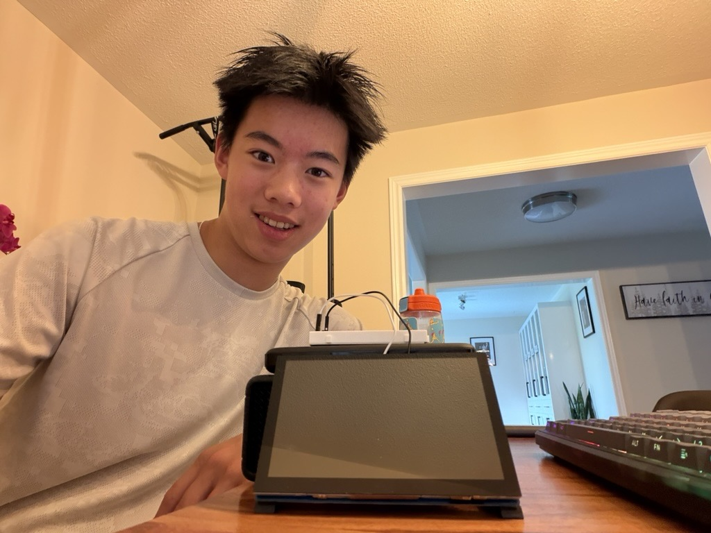
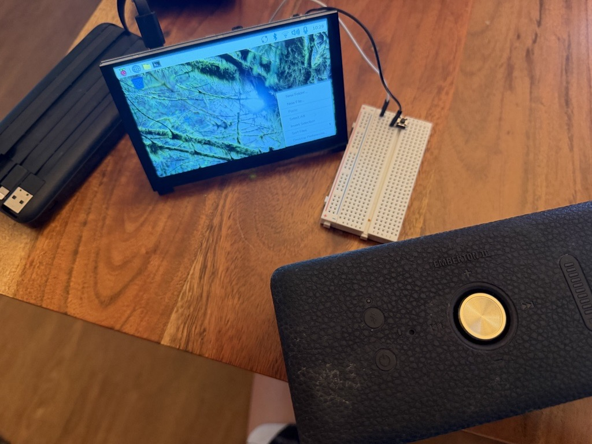
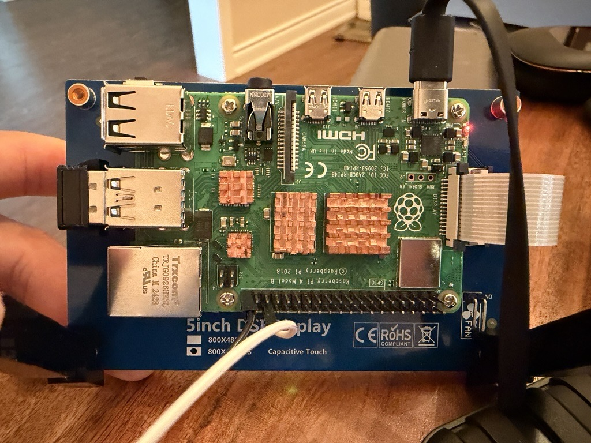

# ChatGPT AI Assist
The project that I am making is a Ras-pi ChatGPT Assistant. This uses the Raspberry Pi computer and using it to create a voice-enabled ChatGPT interface that allowed me to speak to it and generate spoken responses. This creates a hands-free, conversational experience similar to interacting with a smart voice assistant. My project combines both hardware and software components, including the Raspberry Pi, a microphone, speakers, speech recognition, the ChatGPT API, and text-to-speech synthesis.

| **Name** | **School** | **Area of Interest** | **Grade** |
|:--:|:--:|:--:|:--:|
| Frederick J | Appleby College | Electrical Engineering | Incoming Sophomore


  
# Final Milestone

<iframe width="560" height="315" src="https://www.youtube.com/embed/F_AnLWEBznc?si=xzdXgBXDbtgiaMOO" title="YouTube video player" frameborder="0" allow="accelerometer; autoplay; clipboard-write; encrypted-media; gyroscope; picture-in-picture; web-share" allowfullscreen></iframe>

Since my previous milestone, I was able to get my project to fully work. I can now talk to the AI assistant and it could give me a response in a few seconds. Some other things that I added on to it is a monitor, a bluetooth speaker, and mobile power. The monitor allows me to edit and eventually display the AI assistant without connecting an external device. The bluetooth speaker gives me way better audio that the cheap usb speakers and is dramatically louder. Lastly, the mobile power bank makes my assistant portable, meaning that I don't have to always connect a power source to the raspberry pi. Something that has been surprising about the project so far is how much the assistant and the pi can do. It actually becomes so helpful when you are trying to get info fast, and repurposing it in the future could even maybe let it access visual elements and even more. From the previous milestone, I overcame the ssh issues and the mic issues. Now the ChatGPT AI Assistant could actually hear me now and process the audio before sending responses back to me. 

At BSE, some of the biggest challenges and triumphs are trying to figure out all of the bbugs in the code and debugging them. It has been really difficult to search up the error codes and trying to fix them. However, with the help of my instructor and searching stuff up, I was able to figure these things out.

In summary, I learned how to connect a raspberry pi, install packages, and how to make my project work. I learned the process behind the AI assistant and how the information is transferred in the software. In the future, I wish to keep working on my project and learn more things that I can add on to what I have. 

# First Milestone

<iframe width="560" height="315" src="https://www.youtube.com/embed/RjnOawhe9nk?si=F7XG3wbCmmwDfkaE" title="YouTube video player" frameborder="0" allow="accelerometer; autoplay; clipboard-write; encrypted-media; gyroscope; picture-in-picture; web-share" allowfullscreen></iframe>

For my first milestone, I intend on finishing my hardware and raspberry pi setup. I plan to build a AI assistant in which I could talk to it and get responses back. I will have a raspberry pi as the big computer, a usb mic to recieve audio, a usb speaker to emmit audio, and a breadboard and switch to turn the assistant into listening mode. I finished setting all of this up as well as most of the software needed for the assistant to work. In the video, I demonstrated that my ai assistant could listen to me and replay what I have said. Some challenges that i faced along the way was that the SSH didn't work for a long time. I couldn't get the raspi to connect with the external device for a long time, and had to reflash more than ten times. I am still dealing with some issues with the mic and it is not picking up any audio on startup. My plan is to fix those issues I am am pretty much done with my base project.

# Schematics 




# Code
This is the code used for my project from the instructables website.

```python
# SPDX-FileCopyrightText: 2023 Melissa LeBlanc-Williams for Adafruit Industries
#
# SPDX-License-Identifier: MIT

import threading
import os
import sys

from datetime import datetime, timedelta
from queue import Queue
import time
import random
from tempfile import NamedTemporaryFile

import azure.cognitiveservices.speech as speechsdk
import speech_recognition as sr
import openai

import board
import digitalio

# ChatGPT Parameters
SYSTEM_ROLE = (
    "You are a helpful voice assistant in the form of a sweet kindergarten teacher"
    " that answers questions and gives information"
)
CHATGPT_MODEL = "gpt-3.5-turbo"
WHISPER_MODEL = "whisper-1"

# Azure Parameter
AZURE_SPEECH_VOICE = "en-GB-HollieNeural"
DEVICE_ID = None

# Speech Recognition Parameters
ENERGY_THRESHOLD = 1000  # Energy level for mic to detect
PHRASE_TIMEOUT = 3.0  # Space between recordings for sepating phrases
RECORD_TIMEOUT = 0

# Import keys from environment variables
openai.api_key = os.environ.get("OPENAI_API_KEY")
speech_key = os.environ.get("SPEECH_KEY")
service_region = os.environ.get("SPEECH_REGION")

if openai.api_key is None or speech_key is None or service_region is None:
    print(
        "Please set the OPENAI_API_KEY, SPEECH_KEY, and SPEECH_REGION environment variables first."
    )
    sys.exit(1)

speech_config = speechsdk.SpeechConfig(subscription=speech_key, region=service_region)
speech_config.speech_synthesis_voice_name = AZURE_SPEECH_VOICE


def sendchat(prompt):
    completion = openai.ChatCompletion.create(
        model=CHATGPT_MODEL,
        messages=[
            {"role": "system", "content": SYSTEM_ROLE},
            {"role": "user", "content": prompt},
        ],
    )
    # Send the heard text to ChatGPT and return the result
    return completion.choices[0].message.content


def transcribe(wav_data):
    # Read the transcription.
    print("Transcribing...")
    attempts = 0
    while attempts < 3:
        try:
            with NamedTemporaryFile(suffix=".wav") as temp_file:
                result = openai.Audio.translate_raw(
                    WHISPER_MODEL, wav_data, temp_file.name
                )
                return result["text"].strip()
        except (openai.error.ServiceUnavailableError, openai.error.APIError):
            time.sleep(3)
        attempts += 1
    return "I wasn't able to understand you. Please repeat that."

class Listener:
    def __init__(self):
        self.listener_handle = None
        self.recognizer = sr.Recognizer()
        self.recognizer.energy_threshold = ENERGY_THRESHOLD
        self.recognizer.dynamic_energy_threshold = False
        self.recognizer.pause_threshold = 1
        self.last_sample = bytes()
        self.phrase_time = datetime.utcnow()
        self.phrase_timeout = PHRASE_TIMEOUT
        self.phrase_complete = False
        # Thread safe Queue for passing data from the threaded recording callback.
        self.data_queue = Queue()
        self.mic_dev_index = None

    def listen(self):
        if not self.listener_handle:
            with sr.Microphone(device_index = 1) as source:
                print(source.stream)
                self.recognizer.adjust_for_ambient_noise(source)
                audio = self.recognizer.listen(source, timeout=RECORD_TIMEOUT)
            data = audio.get_raw_data()
            self.data_queue.put(data)

    def record_callback(self, _, audio: sr.AudioData) -> None:
        # Grab the raw bytes and push it into the thread safe queue.
        data = audio.get_raw_data()
        self.data_queue.put(data)

    def speech_waiting(self):
        return not self.data_queue.empty()

    def get_speech(self):
        if self.speech_waiting():
            return self.data_queue.get()
        return None

    def get_audio_data(self):
        now = datetime.utcnow()
        if self.speech_waiting():
            self.phrase_complete = False
            if self.phrase_time and now - self.phrase_time > timedelta(
                seconds=self.phrase_timeout
            ):
                self.last_sample = bytes()
                self.phrase_complete = True
            self.phrase_time = now

            # Concatenate our current audio data with the latest audio data.
            while self.speech_waiting():
                data = self.get_speech()
                self.last_sample += data

            # Use AudioData to convert the raw data to wav data.
            with sr.Microphone() as source:
                audio_data = sr.AudioData(
                    self.last_sample, source.SAMPLE_RATE, source.SAMPLE_WIDTH
                )
            return audio_data

        return None

class Chat:
    def __init__(self, azure_speech_config):

        #Setup Button
        self._button = digitalio.DigitalInOut(board.D16)
        self._button.direction = digitalio.Direction.INPUT
        self._button.pull = digitalio.Pull.UP
        audio_config = speechsdk.audio.AudioOutputConfig(use_default_speaker=True)
        self._speech_synthesizer = speechsdk.SpeechSynthesizer(
        speech_config=azure_speech_config, audio_config=audio_config
       )
        if DEVICE_ID is None:
            audio_config = speechsdk.audio.AudioOutputConfig(use_default_speaker=True)
        else:
            audio_config = speechsdk.audio.AudioOutputConfig(device_name=DEVICE_ID)
        self._speech_synthesizer = speechsdk.SpeechSynthesizer(
            speech_config=azure_speech_config, audio_config=audio_config
        )

    def deinit(self):
        self._speech_synthesizer.synthesis_started.disconnect_all()
        self._speech_synthesizer.synthesis_completed.disconnect_all()

    def button_pressed(self):
        return not self._button.value

    def speak(self, text):
        result = self._speech_synthesizer.speak_text_async(text).get()

        # Check result
        if result.reason == speechsdk.ResultReason.SynthesizingAudioCompleted:
            print("Speech synthesized for text [{}]".format(text))
        elif result.reason == speechsdk.ResultReason.Canceled:
            cancellation_details = result.cancellation_details
            print("Speech synthesis canceled: {}".format(cancellation_details.reason))
            if cancellation_details.reason == speechsdk.CancellationReason.Error:
                print("Error details: {}".format(cancellation_details.error_details))


def main():
    listener = Listener()
    chat = Chat(speech_config)
    transcription = [""]
    chat.speak(
        "Hello! My name is Lilly and I'm you personal assistant. You can ask me anything. Just press the red button whenever you would like to talk to me"
    )
    while True:
        try:
            # If button is pressed, start listening
            if chat.button_pressed():
                chat.speak("How may I help you?")
                listener.listen()

            # Pull raw recorded audio from the queue.
            if listener.speech_waiting():
                audio_data = listener.get_audio_data()
                chat.speak("let me think about that")
                text = transcribe(audio_data.get_wav_data())

                if text:
                    if listener.phrase_complete:
                        transcription.append(text)
                        print(f"Phrase Complete. Sent '{text}' to ChatGPT.")
                        chat_response = sendchat(text)
                        transcription.append(f"> {chat_response}")
                        print("Got response from ChatGPT. Beginning speech synthesis.")
                        chat.speak(chat_response)
                    else:
                        print("Partial Phrase...")
                        transcription[-1] = text

                os.system("clear")
                for line in transcription:
                    print(line)
                print("", end="", flush=True)
                time.sleep(0.25)
        except KeyboardInterrupt:
            break
    chat.deinit()

if __name__ == "__main__":
    main()

```

# Bill of Materials

| **Part** | **Note** | **Price** | **Link** |
|:--:|:--:|:--:|:--:|
| Raspberry Pi | Used for being the computer of the project  | $95.19 | <a href="https://www.amazon.com/RasTech-Raspberry-Starter-Heatsink-Screwdriver/dp/B0C8LV6VNZ/"> Link </a> |
| USB Mic | Capture voice commands | $7.56 | <a href="https://www.amazon.com/dp/B01MQ2AA0X?ref=fed_asin_title"> Link </a> |
| Speaker | Emmit Audio | $13.99 | <a href="https://www.amazon.com/Mobile-Speaker-Compact-Adhesive-Installation/dp/B0D95ZYCW6/"> Link </a> |
| Screwdriver Set | Screw Screws | $5.94 | <a href="https://www.amazon.com/Small-Screwdriver-Set-Mini-Magnetic/dp/B08RYXKJW9/"> Link </a> |
| Screen | Monitor  | $48.95 | <a href="https://www.amazon.ca/Freenove-Touchscreen-Raspberry-Capacitive-Driver-Free/dp/B0B455LDKH/ref=sr_1_2_sspa?crid=OQBCOAOP88TL&dib=eyJ2IjoiMSJ9.1ZP-x4GHf2bcWw7fBBlvjsT46rIXAvkE0H331aIl8FAkbJRCKhd-pnI2ZwOvSuPL4RtzPlki5UYA2eBSsEo6HbXBlhEborLKIdEWTiPTTLzerCnh0nYP0_TbflmFj_9G0oJsPQLkCe6PS5d78qHZLwLDx-QDT_gnI7qF3nRlsQi_Vm8kU9NkXcM5BbxOUGaKpLOmknhEjMpyXurIq_l_lwxLLQ98JvOVTneIahAxS_o2jWDGE4F0YbOcVTdbTTgtt-ohDw8otjMbSnlluE57aqdHoldDx12L3zrxyLXk3lE.nrTatiTA204s0YHM-0JkqKNkzsKVabb3qkPt71vNq-k&dib_tag=se&keywords=raspi%2Btouch%2Bscreen&qid=1783696509&sprefix=raspi%2Bscreen%2B%2Caps%2C107&sr=8-2-spons&sp_csd=d2lkZ2V0TmFtZT1zcF9hdGY&th=1"> Link </a> |


# Other Resources/Examples

- [Instructables Original Project](https://www.instructables.com/Customizes-a-ChatGPT-Assistant-Using-a-RaspberryPi/)
- [OpenAI Key](https://learn.adafruit.com/robotic-ai-bear-using-chatgpt/create-an-account-with-openai)
- [Azure Speech Key](https://learn.adafruit.com/robotic-ai-bear-using-chatgpt/create-an-account-with-azure)
